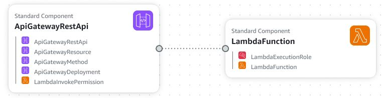

# Lambda API Gateway for Sending SMS

This project contains an AWS CloudFormation template that deploys an AWS Lambda function triggered by an HTTP POST request through Amazon API Gateway. The goal is to make it easy for users to integrate a Lambda function to send SMS messages or perform other actions via a REST API.

## Description

This template defines the following AWS resources:
- **AWS Lambda**: A function used to send SMS (code is in `index.mjs`).
- **API Gateway**: A REST API that receives HTTP POST requests and forwards them to the Lambda function.
- **IAM Role**: An IAM role that allows Lambda to write to CloudWatch logs and be invoked by API Gateway.

The basic flow is that a user sends a POST request to API Gateway, which triggers the Lambda function to process the request.

<p align="center">
  
</p>

## Requirements

To use this template, make sure you have the following:

1. **AWS Account**: You need an AWS account with permissions to create Lambda, API Gateway, and IAM resources.
2. **AWS CLI**: You must have the AWS Command Line Interface (CLI) installed to interact with AWS from your terminal.
3. **Lambda function code**: The Lambda function code must be packaged in a `.zip` file (e.g., `function.zip`) and uploaded to an S3 bucket.
4. **Configure Amazon SNS for SMS**:
   - **Enable SMS in SNS**:
     1. Go to the Amazon SNS console.
     2. In the sidebar, select **Text messaging (SMS)**.
     3. Click **Preferences** and adjust the following settings:
        - **Account spend limit**: Set a monthly spend limit (e.g., $1 USD for testing).
        - **Default message type**: Choose **Promotional** or **Transactional** depending on your use case. For testing, use **Transactional**.
   - **Validate phone numbers**:
     If your account is in sandbox mode, you must register phone numbers before sending SMS:
     1. Go to **Text messaging (SMS) > Phone numbers**.
     2. Register the phone number and verify the received message.

## Customization

- You should modify the Lambda function code location by updating the `S3Bucket` and `S3Key` properties.
- To change the API Gateway stage name, modify the `StageName` property under `ApiGatewayDeployment`.
- You can further customize the Lambda function's behavior or permissions based on your use case.

## How to Use

### 1. **Upload your Lambda code to S3**

Before deploying the template, you must have your Lambda function code in a `.zip` file uploaded to an S3 bucket. You can do this via the S3 console or the AWS CLI.

```bash
aws s3 cp function.zip s3://your-s3-bucket/
```
### 2. Deploy the CloudFormation Template

```bash
aws cloudformation create-stack --stack-name sms-lambda-stack --template-body file://sms-lambda-iac.yaml --capabilities CAPABILITY_IAM
```
Save this YAML template to a file, e.g., lambda_api_gateway.yaml, and deploy it using the AWS CLI:

### 3. Access the API
Once deployed, the API Gateway will be running, and you can access it at the following URL (replace <ApiId> and <Region>):

```bash
https://<ApiId>.execute-api.<Region>.amazonaws.com/stage/send-sms
```

### 4. Make a POST request to the API
Send a POST request to the API URL to trigger the Lambda function. Here's an example of how to make a request using curl:

```bash
curl -X POST https://<ApiId>.execute-api.<Region>.amazonaws.com/stage/send-sms \
  -H "Content-Type: application/json" \
  -d '{"phoneNumber": "+1234567890", "message": "Hello from AWS"}'
```
