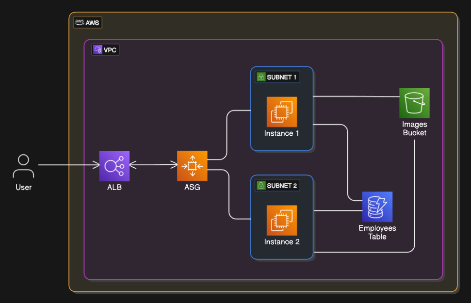

# Highly available web app (employee dorectory)

<p align="center">
  
</p>
This CloudFormation template is designed to deploy a highly avaiable Employee Directory web application. It sets up the necessary AWS infrastructure, including an S3 bucket for storing images, a DynamoDB table for employee data, IAM roles, EC2 instances, an Application Load Balancer (ALB), and an Auto Scaling Group (ASG).

## Components Created

- S3 Bucket: Stores images with a bucket policy to control access.
- DynamoDB Table: Named "Employees" to store employee data.
- IAM Role: S3DynamoDBFullAccessRole with full access to S3 and DynamoDB.
- Launch Template: For EC2 instances with a user data script to set up the application.
- Application Load Balancer: Distributes incoming traffic across multiple targets.
- Auto Scaling Group: Manages the number of EC2 instances based on demand.

## Parameters

- VPCId: ID of the VPC where resources will be created.
- SubnetIds: List of Subnet IDs for the ALB and Auto Scaling Group.
- KeyName: Name of an existing KeyPair for SSH access to EC2 instances.
- InstanceType: EC2 instance type (default: t2.micro).
- DesiredCapacity: Desired number of instances in the Auto Scaling Group (default: 1).
- MinSize: Minimum number of instances in the Auto Scaling Group (default: 1).
- MaxSize: Maximum number of instances in the Auto Scaling Group (default: 3).
- AccountNumber: AWS account number for the S3 bucket policy.
- ImagesBucketName: Name of the S3 bucket to store images (default: employee-directory-web-app).

## How to Execute

Ensure you have the AWS CLI installed and configured with the necessary permissions.

To deploy this stack using `terraform` go to the [terraform-folder](./terraform) and follow the instructions

 - Deploy the Stack:
 - Save the template to a file, e.g., employee-directory-template.yaml.
 - Run the following command to create the stack:


```bash
aws cloudformation create-stack 
--stack-name employee-directory-stack 
--template-body file://employee-directory-template.yaml 
--parameters 
ParameterKey=VPCId,ParameterValue=<your-vpc-id> ParameterKey=SubnetIds,ParameterValue=<your-subnet-ids> ParameterKey=KeyName,ParameterValue=<your-key-name> ParameterKey=InstanceType,ParameterValue=<your-instance-type> ParameterKey=DesiredCapacity,ParameterValue=<desired-capacity> ParameterKey=MinSize,ParameterValue=<min-size> ParameterKey=MaxSize,ParameterValue=<max-size> ParameterKey=AccountNumber,ParameterValue=<your-account-number> ParameterKey=ImagesBucketName,ParameterValue=<your-bucket-name>
```

Replace placeholders (e.g., <your-vpc-id>) with actual values.

## Monitor the Stack

Use the AWS Management Console or CLI to monitor the stack creation process.

 - Access the Application: Once the stack is created, access the application using the DNS name of the Application Load Balancer, which is output as LoadBalancerDNSName.

## Acknolegments

The code used in this repo comes from aws cloud formation [AWS Technical Essentials](https://aws.amazon.com/training/classroom/aws-technical-essentials/) course

This implemetantion dosen't aim to claim credit of this code or course it itends to expand on it by showing how infrastructure as code could be inplemented